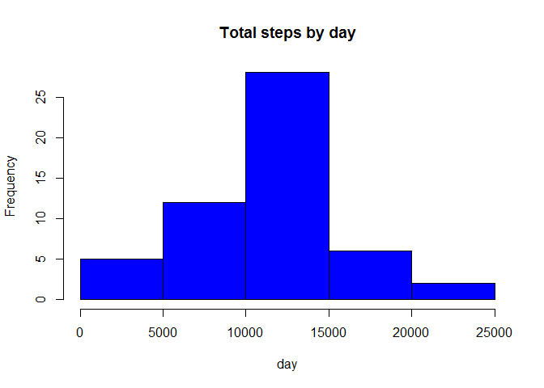
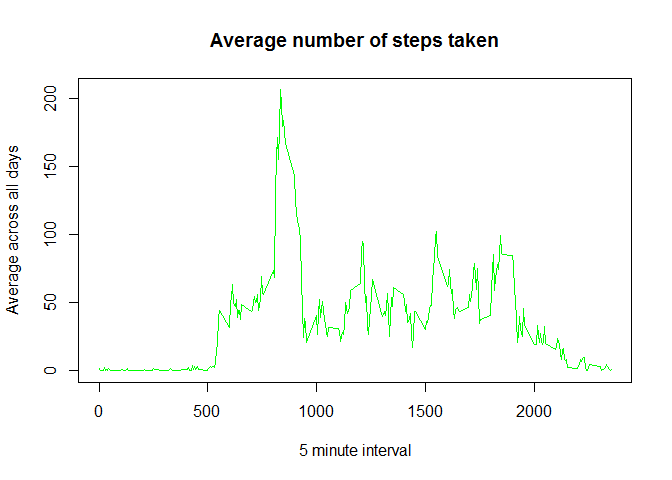
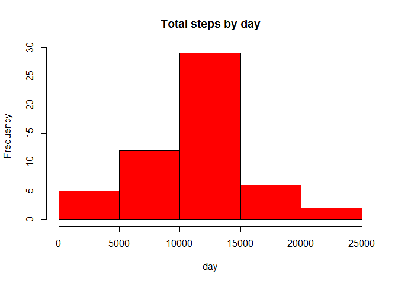
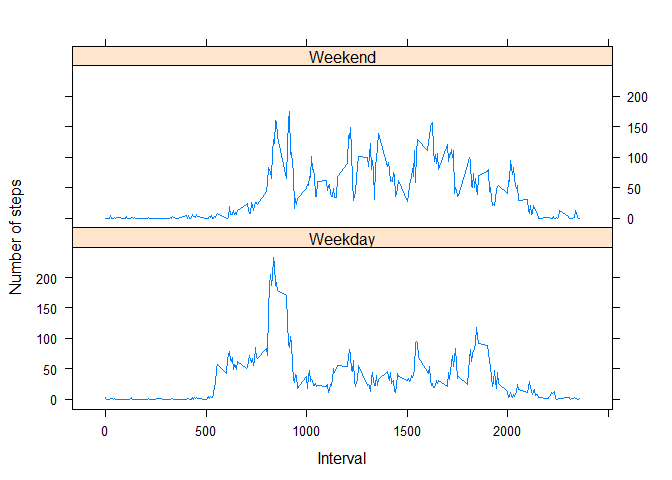

# Reproducible Research: Peer Assessment 1


## Loading and preprocessing the data

```r
activity <- read.csv("activity.csv")

#head(activity)

activity$date <- as.Date(activity$date)
```


## What is mean total number of steps taken per day?

```r
StepsTotal <- aggregate(steps ~ date, data = activity, sum, na.rm = TRUE)
#head(StepsTotal)

library(lattice)
hist(StepsTotal$steps, main = "Total steps by day", xlab = "day", col = "blue")
```

 

```r
mean(StepsTotal$steps)
```

```
## [1] 10766.19
```

```r
median(StepsTotal$steps)
```

```
## [1] 10765
```

## What is the average daily activity pattern?

```r
time_series <- tapply(activity$steps, activity$interval, mean, na.rm = TRUE)
#head(time_series)

plot(row.names(time_series), time_series, type = "l", xlab = "5 minute interval", 
    ylab = "Average across all days", main = "Average number of steps taken", 
    col = "green")
```

 

```r
names(which.max(time_series))
```

```
## [1] "835"
```
## Imputing missing values

```r
activity_NA <- sum(is.na(activity))
activity_NA
```

```
## [1] 2304
```

```r
new_activity <- activity
#To be filled with the mean for that 5-minute interval
StepsAverage <- aggregate(steps ~ interval, data = activity, FUN = mean)
#head(StepsAverage)

for (i in 1:nrow(activity)) {
    if (is.na(activity[i, ]$steps)) {
    new_activity$steps[i]=StepsAverage$steps[i]
    }
}
#head(new_activity)

StepsTotal2 <- aggregate(steps ~ date, data = new_activity, sum, na.rm = TRUE)
#head(StepsTotal2)

hist(StepsTotal2$steps, main = "Total steps by day", xlab = "day", col = "red")
```

 

```r
mean(StepsTotal2$steps)
```

```
## [1] 10766.19
```

```r
median(StepsTotal2$steps)
```

```
## [1] 10765.59
```

```r
#mean remains the same while median changes
```
## Are there differences in activity patterns between weekdays and weekends?

```r
day <- weekdays(new_activity$date)
daylevel <- vector()
for (i in 1:nrow(new_activity)) {
    if (day[i] == "Saturday") {
        daylevel[i] <- "Weekend"
    } else if (day[i] == "Sunday") {
        daylevel[i] <- "Weekend"
    } else {
        daylevel[i] <- "Weekday"
    }
}
new_activity$daylevel <- daylevel
new_activity$daylevel <- factor(new_activity$daylevel)

stepsByDay <- aggregate(steps ~ interval + daylevel, data = new_activity, mean)
names(stepsByDay) <- c("interval", "daylevel", "steps")

xyplot(steps ~ interval | daylevel, stepsByDay, type = "l", layout = c(1, 2), 
    xlab = "Interval", ylab = "Number of steps")
```

 
